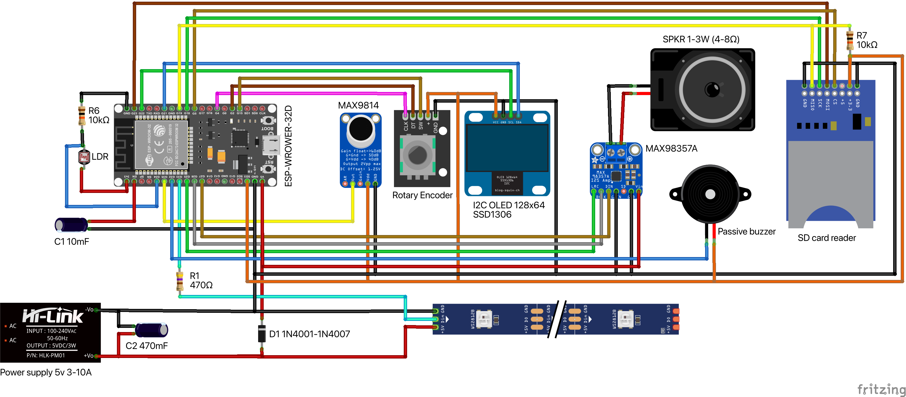

# The ESP32 based spectrum analyzer 32x16 LED matrix VU meter

### Main components:
 - Controller ESP32 WROOM-32D
 - Touch sensor TTP223B
 - Microphone Amplifier MAX9814 (with Auto Gain Control)
 - Rotary encoder
 - OLED I2C screen 128x64
 - WS2812B (two 16x16 zig-zag matrix) 

The controller can handle a few separate led strips or matrix. 
The current schema and code can handle 4 strips/matrix.

Please be careful with a power supply, it should provide enough power to supply the leds. 
Each LED draws about 50mA, when set to its full brightness. 
This means that for every 30 LEDs, the strip may draw as much as 1.5 A.
The matrix 16x32 contains 512 LEDs and needs 25A to show the full brightness.
You can restrict the max current for a strip/matrix on the program level. 

- Capacitor C1 10mF - to avoid the boot btn press during firmware uploading.
- Capacitor C2 470mf - power supply noise filter.
- Resistors R1-R4 330Ω–470Ω - protection resistors, place the resistors as close as possible to the ESP32 pin for maximum effectiveness (voltage spikes can damage the first LED in the chain or cause erratic behavior)  
- Diode D1 1N4001-1N4007 - to prevent LEDs power supply from USB port during firmware update.

### Images: 

### Notes: 
- Please use **[sample_test.ino](sampleTest/sample_test.ino)** and **[FFT.xlsx](sampleTest/FFT.xlsx)** to calculate Band values based on the microcontroller ADC speed.

### TODO:
- WEB control
- Vertical/Horizontal mode
- IR control
- Light mode
- Time Mode
- Connect with the home weather station
- Games
- More effects

